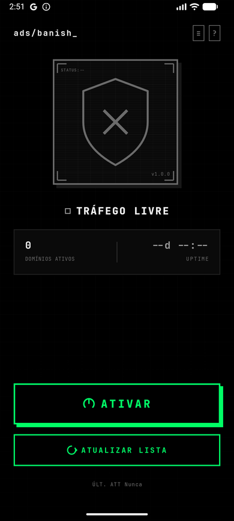
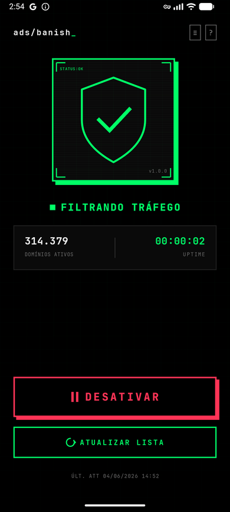

```
 █████╗ ██████╗ ███████╗██████╗  █████╗ ███╗   ██╗██╗███████╗██╗  ██╗
██╔══██╗██╔══██╗██╔════╝██╔══██╗██╔══██╗████╗  ██║██║██╔════╝██║  ██║
███████║██║  ██║███████╗██████╔╝███████║██╔██╗ ██║██║███████╗███████║
██╔══██║██║  ██║╚════██║██╔══██╗██╔══██║██║╚██╗██║██║╚════██║██╔══██║
██║  ██║██████╔╝███████║██████╔╝██║  ██║██║ ╚████║██║███████║██║  ██║
╚═╝  ╚═╝╚═════╝ ╚══════╝╚═════╝ ╚═╝  ╚═╝╚═╝  ╚═══╝╚═╝╚══════╝╚═╝  ╚═╝
```

<div align="center">

**DNS-level ad blocker for Android — no root required**


</div>

---

## `> OVERVIEW`

**ADSBanish** intercepts DNS queries at the system level using a local VPN tunnel. When your device resolves a domain, ADSBanish checks it against a blocklist of hundreds of thousands of ad, tracker, and malware domains — responding with `NXDOMAIN` before any connection is established.

No proxy. No HTTPS inspection. No root. Zero traffic leaves the device.

```
App Request → DNS Query → [ TUN Interface ]
                                │
                    ┌───────────▼───────────┐
                    │  PacketProcessor      │
                    │  isBlocked(domain)?   │
                    └───────────┬───────────┘
                                │
               ┌────────────────┴────────────────┐
           YES │                                  │ NO
               ▼                                  ▼
          NXDOMAIN ←                    Forward → 1.1.1.1
```

---

## `> SCREENSHOTS`

<div align="center">

| Proteção desativada | Proteção ativa |
|:---:|:---:|
|  |  |
| `STATUS:--` · TRÁFEGO LIVRE | `STATUS:OK` · FILTRANDO TRÁFEGO |

</div>

---

## `> FEATURES`

| Feature | Description |
|---|---|
| `DNS interception` | Captures all UDP port 53 traffic via TUN interface |
| `NXDOMAIN response` | Blocked domains receive a valid DNS refusal, not silence |
| `HashSet O(1) lookup` | Millions of DNS queries per day, zero perceptible latency |
| `5 blocklist sources` | StevenBlack, OISD Small/Big, Peter Lowe, AdGuard DNS |
| `Dual format parsing` | Supports `HOSTS` (`0.0.0.0 domain`) and `ADBLOCK` (`\|\|domain^`) |
| `Safe download` | Writes to temp file first — current list never corrupted on failure |
| `Hierarchy matching` | `sub.ads.example.com` → checks `sub`, `ads.example.com`, `example.com` |
| `Boot persistence` | VPN auto-restarts on device reboot via `BootReceiver` |
| `No root required` | Uses Android VpnService API — works on any unrooted device |

---

## `> BLOCKLIST SOURCES`

```
┌─────────────────────────────────────────────────────────────────┐
│  SOURCE          │  DOMAINS   │  FOCUS                          │
├──────────────────┼────────────┼─────────────────────────────────┤
│  StevenBlack     │  ~150k     │  Ads + Malware + Tracking       │
│  OISD Small      │  ~50k      │  Ads + Tracking (lightweight)   │
│  OISD Big        │  ~300k+    │  Ads + Tracking + Malware       │
│  Peter Lowe      │  ~3k       │  Ads only (minimalist)          │
│  AdGuard DNS     │  ~50k      │  Curated by AdGuard team        │
└─────────────────────────────────────────────────────────────────┘
```

---

## `> ARCHITECTURE`

```
Application
└── BlocklistRepository          (singleton, lazy init)
     ├── loadIntoMemory()        → HashSet<String> in RAM
     ├── downloadAndUpdate()     → HttpURLConnection, no OkHttp
     └── isBlocked(domain)       → O(1) lookup + hierarchy walk

MainActivity
└── MainViewModel                (AndroidViewModel)
     ├── DownloadState           → Idle | Loading(progress) | Success | Error
     └── updateBlocklist()       → coroutine on Dispatchers.IO

AdBlockVpnService                (foreground, VpnService)
└── PacketProcessor
     ├── reads raw IP packets    → FileInputStream on TUN fd
     ├── filters UDP port 53     → DNS only
     ├── DnsPacket.parse()       → extracts question name
     └── isBlocked(domain)?      → NXDOMAIN or forward to 1.1.1.1
```

**Stack:**
- Language: `Kotlin`
- UI: `Jetpack Compose` + `JetBrains Mono` typeface · neobrutalismo dark theme
- Async: `Kotlin Coroutines`
- Networking: `HttpURLConnection` (zero third-party HTTP deps)
- State: `StateFlow` / `AndroidViewModel`
- Min SDK: `26` (Android 8.0) · Target SDK: `35`
- Icon: adaptive icon (PNG foreground per density + vector black background) — safe zone compliant

---

## `> INSTALL`

### From release APK

Download the latest APK from [**Releases**](https://github.com/rbracini/adsbanish/releases/latest) and install directly:

```bash
adb install adsbanish_vX.Y.Z.apk
```

Or transfer to device and open with any file manager (requires *Install from unknown sources*).

> Each release is automatically built and signed via GitHub Actions on every version tag.

### Build from source

```bash
git clone https://github.com/rbracini/adsbanish.git
cd adsbanish

./gradlew assembleDebug                  # debug build
./gradlew installDebug                   # build + install via ADB
./gradlew assembleRelease                # signed release build
```

**Requirements:** JDK 17 · Android SDK 35 · Gradle 8.7+

---

## `> PERMISSIONS`

| Permission | Reason |
|---|---|
| `INTERNET` | DNS forwarding to upstream resolver |
| `FOREGROUND_SERVICE` | VPN runs as persistent foreground service |
| `FOREGROUND_SERVICE_SPECIAL_USE` | Required for VPN service type |
| `POST_NOTIFICATIONS` | Active VPN notification |
| `RECEIVE_BOOT_COMPLETED` | Auto-start VPN after device reboot |
| `BIND_VPN_SERVICE` | Core Android VPN permission |

---

## `> HOW IT WORKS`

1. User activates the VPN — Android shows the system permission dialog
2. `AdBlockVpnService` creates a TUN interface and establishes the VPN tunnel
3. All device traffic is routed through the TUN file descriptor
4. `PacketProcessor` reads raw IP packets in a loop
5. Non-UDP and non-port-53 packets are forwarded as-is
6. DNS packets are parsed by `DnsPacket` to extract the queried domain
7. `BlocklistRepository.isBlocked()` performs a HashSet lookup (and parent domain walk)
8. **Blocked:** a well-formed `NXDOMAIN` response is written back to the TUN
9. **Allowed:** the query is forwarded to `1.1.1.1` and the response relayed back

The blocklist lives entirely in RAM as a `HashSet<String>`. Updating the list replaces the set atomically — the running VPN picks up new domains instantly without restart.

---

## `> PROJECT STRUCTURE`

```
app/src/main/java/br/com/adsbanish/
├── App.kt                        ← Application, repository init
├── blocklist/
│   ├── BlocklistSource.kt        ← 5 sources enum + format enum
│   ├── BlocklistRepository.kt    ← download, parse, persist, lookup
│   └── BlocklistData.kt          ← hardcoded fallback (~150 domains)
├── vpn/
│   ├── AdBlockVpnService.kt      ← foreground VPN service
│   ├── PacketProcessor.kt        ← raw packet I/O, DNS interception
│   ├── DnsPacket.kt              ← DNS parser + NXDOMAIN builder
│   ├── VpnState.kt               ← sealed class: Inactive | Active | Error
│   └── BootReceiver.kt           ← auto-start on boot
└── ui/
    ├── MainActivity.kt
    ├── MainViewModel.kt
    ├── MainScreen.kt             ← single-screen Compose UI
    └── theme/
        ├── Color.kt
        ├── Theme.kt
        └── Type.kt
```

---

## `> LICENSE`

```
MIT License — use freely, credit appreciated.
```

---

<div align="center">

```
STATUS:OK ████████████████ 100%
```

*Block everything. Trust nothing.*

</div>
